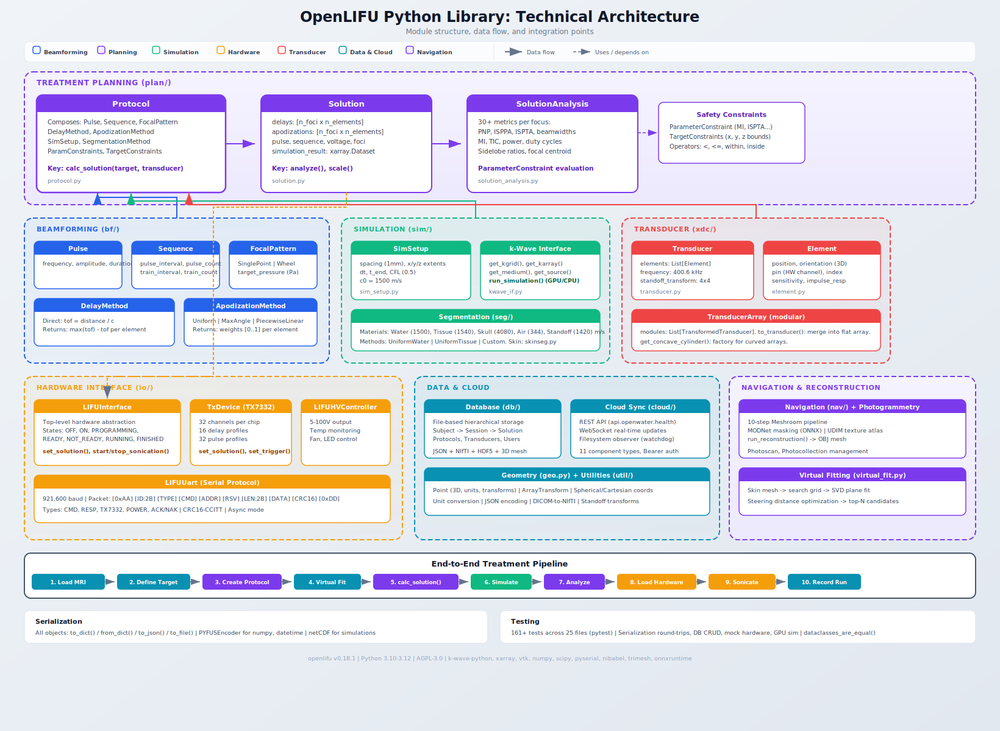

Architecture Overview
=====================

This document describes the internal architecture of the ``openlifu`` Python
library, a toolbox for planning and controlling focused ultrasound treatments.
It covers the module structure, core data flow, class hierarchies, and
integration points between subsystems.

   High-level architecture diagram of the OpenLIFU library, showing module
   structure, data flow between components, and the end-to-end treatment
   planning pipeline.

.. contents:: Table of Contents
   :depth: 3
   :local:

Module Map
----------

The library is organized into 10 top-level modules under ``src/openlifu/``:

.. code-block:: text

   openlifu/
   ├── bf/          Beamforming (pulses, sequences, delays, apodization, focal patterns)
   ├── plan/        Treatment planning (protocols, solutions, analysis, constraints)
   ├── xdc/         Transducer geometry (elements, arrays, transformations)
   ├── sim/         Acoustic simulation (k-Wave integration, grid setup)
   ├── seg/         Tissue segmentation (materials, segmentation methods)
   ├── io/          Hardware interface (TX7332 driver, HV controller, UART)
   ├── db/          Database (file-based persistence for subjects, sessions, protocols)
   ├── nav/         Navigation (photogrammetry, Meshroom reconstruction, masking)
   ├── cloud/       Cloud sync (REST API, WebSocket, filesystem observer)
   ├── util/        Utilities (units, JSON encoding, volume conversion, strings)
   ├── geo.py       Geometry primitives (Point, ArrayTransform, coordinate math)
   └── virtual_fit.py  Transducer placement optimization

The library is organized into 70+ Python files.

End-to-End Treatment Workflow
-----------------------------

The library supports a complete treatment pipeline from patient imaging through
hardware execution:

.. code-block:: text

   1. Load Patient MRI        (db, util/volume_conversion)
   2. Define Target            (geo.Point)
   3. Create Protocol          (plan.Protocol with bf, sim, seg components)
   4. Virtual Fit Transducer   (virtual_fit + seg/skinseg)
   5. Compute Solution         (plan.Protocol.calc_solution)
      a. Beamform              (bf.DelayMethod + bf.ApodizationMethod)
      b. Simulate              (sim.run_simulation via k-Wave)
      c. Analyze               (plan.SolutionAnalysis)
      d. Scale                 (plan.Solution.scale)
   6. Load to Hardware         (io.LIFUInterface.set_solution)
   7. Execute Sonication       (io.LIFUInterface.start_sonication)
   8. Record Run               (plan.Run, db.Database)

Each step maps to one or more modules. The ``Protocol`` class in
``plan/protocol.py`` serves as the central orchestrator, composing
beamforming, simulation, and segmentation components through its
``calc_solution()`` method.

Beamforming Module (``bf/``)
----------------------------

The beamforming module defines the acoustic parameters of a treatment:
what pulses to send, in what sequence, where to focus, and how to
calculate per-element delays and weights.

Pulse and Sequence
~~~~~~~~~~~~~~~~~~

``Pulse`` defines a sinusoidal burst:

- ``frequency`` (Hz), ``amplitude`` (0-1), ``duration`` (seconds)
- ``calc_pulse(t)`` returns ``amplitude * sin(2*pi*frequency*t)``

``Sequence`` defines pulse timing:

- ``pulse_interval``, ``pulse_count`` (within a train)
- ``pulse_train_interval``, ``pulse_train_count`` (between trains)
- Validates that ``pulse_train_interval >= pulse_interval * pulse_count``

Focal Patterns
~~~~~~~~~~~~~~

Abstract base class ``FocalPattern`` with two concrete implementations:

- ``SinglePoint``: Returns ``[target.copy()]``. One focus.
- ``Wheel``: Returns center point (optional) plus ``num_spokes`` points
  arranged in a circle of ``spoke_radius`` around the target. Uses
  ``target.get_matrix(center_on_point=True)`` to compute spoke positions
  in the target's local coordinate frame.

The ``FocalPattern.target_pressure`` field (in Pa) is used during solution
scaling to adjust apodization and voltage until the simulated peak pressure
matches the target.

Delay Methods
~~~~~~~~~~~~~

Abstract base class ``DelayMethod`` with one concrete implementation:

- ``Direct``: Time-of-flight calculation. For each element, computes
  ``distance_to_target / speed_of_sound``. Returns ``max(tof) - tof``
  so the furthest element has zero delay and all others are advanced.
  Speed of sound is taken from ``params['sound_speed'].attrs['ref_value']``
  or falls back to ``self.c0`` (default 1480 m/s).

Apodization Methods
~~~~~~~~~~~~~~~~~~~

Abstract base class ``ApodizationMethod`` with three implementations:

- ``Uniform``: All elements weighted equally (``np.full(n, value)``).
- ``MaxAngle``: Binary cutoff. Elements with angle to target exceeding
  ``max_angle`` are set to 0; others to 1.
- ``PiecewiseLinear``: Linear rolloff between ``rolloff_angle`` (weight=1)
  and ``zero_angle`` (weight=0).

``MaxAngle`` and ``PiecewiseLinear`` use ``element.angle_to_point()``
to compute the angle between each element's normal vector and the direction
to the target. ``Uniform`` ignores element geometry entirely.

Treatment Planning Module (``plan/``)
-------------------------------------

The planning module orchestrates beamforming, simulation, and analysis
into a complete treatment solution.

Protocol
~~~~~~~~

``Protocol`` is the central configuration object. It composes:

- A ``Pulse`` and ``Sequence`` (what to send)
- A ``FocalPattern`` (where to focus)
- A ``DelayMethod`` and ``ApodizationMethod`` (how to beamform)
- A ``SimSetup`` (simulation grid parameters)
- A ``SegmentationMethod`` (tissue property mapping)
- ``ParameterConstraint`` and ``TargetConstraints`` (safety limits)
- ``SolutionAnalysisOptions`` and ``VirtualFitOptions``

The key method is ``calc_solution()``:

.. code-block:: text

   Protocol.calc_solution(target, transducer, volume, ...)
     |
     +-> check_target(target)              # Validate target is in bounds
     +-> sim_setup.setup_sim_scene(...)     # Create acoustic parameter grid
     +-> focal_pattern.get_targets(target)  # Get list of foci
     |
     +-> FOR EACH focus:
     |     +-> beamform(transducer, focus, params)
     |     |     +-> delay_method.calc_delays(...)   -> delays [n_elements]
     |     |     +-> apod_method.calc_apodization(...) -> apod [n_elements]
     |     +-> run_simulation(...)                   -> xa.Dataset
     |
     +-> Stack results: delays [n_foci x n_elements]
     +-> Create Solution object
     +-> Optionally scale to target_pressure
     +-> Optionally analyze (beamwidth, MI, TIC, intensities)
     +-> Return (Solution, simulation_result, SolutionAnalysis)

Solution
~~~~~~~~

``Solution`` stores the computed sonication plan:

- ``delays``: shape ``(num_foci, num_elements)`` in seconds
- ``apodizations``: shape ``(num_foci, num_elements)`` in [0, 1]
- ``pulse``, ``sequence``, ``voltage``: execution parameters
- ``foci``: list of ``Point`` objects (actual focal positions)
- ``target``: the original target ``Point``
- ``simulation_result``: ``xarray.Dataset`` with pressure fields
- ``approved``: boolean safety flag

The ``analyze()`` method computes 30+ metrics per focus including peak
pressures, beamwidths at -3 dB and -6 dB, sidelobe ratios, mechanical
index, thermal index, and duty cycles. Results are returned as a
``SolutionAnalysis`` dataclass.

The ``scale()`` method adjusts apodizations and voltage so that simulated
peak pressure matches ``FocalPattern.target_pressure``.

Solution Analysis
~~~~~~~~~~~~~~~~~

``SolutionAnalysis`` contains per-focus lists of metrics and
global aggregate values. Key fields:

- ``mainlobe_pnp_MPa``, ``mainlobe_isppa_Wcm2``, ``mainlobe_ispta_mWcm2``
- ``beamwidth_lat_3dB_mm``, ``beamwidth_ele_3dB_mm``, ``beamwidth_ax_3dB_mm``
- ``sidelobe_to_mainlobe_pressure_ratio``
- ``MI`` (mechanical index), ``TIC`` (thermal index cranial)
- ``voltage_V``, ``power_W``, ``duty_cycle_sequence_pct``

Each metric can be evaluated against ``ParameterConstraint`` objects that
define warning and error thresholds with configurable operators
(``<``, ``<=``, ``>``, ``>=``, ``within``, ``inside``, ``outside``).

Transducer Module (``xdc/``)
----------------------------

Models the physical geometry of ultrasound transducer arrays.

Element
~~~~~~~

``Element`` represents a single rectangular transducer element:

- ``position`` (3D), ``orientation`` (3-vector: ``[az, el, roll]`` around
  ``[y, x', z'']`` axes, in radians), ``size`` (width x length)
- ``pin`` (hardware channel mapping), ``index`` (logical index)
- ``sensitivity`` (Pa/V), ``impulse_response`` (FIR filter)

Key methods: ``distance_to_point()``, ``angle_to_point()``,
``get_matrix()`` (4x4 affine from position and orientation),
``calc_output()`` (apply impulse response and sensitivity).

Transducer
~~~~~~~~~~

``Transducer`` is a collection of ``Element`` objects:

- ``elements``: list of Element instances
- ``frequency``: nominal frequency (default 400.6 kHz)
- ``standoff_transform``: 4x4 affine for acoustic coupling layer
- ``module_invert``: per-module polarity flags

Key methods: ``get_positions()``, ``calc_output()`` (with delays and
apodization), ``gen_matrix_array()`` (factory for rectangular arrays),
``merge()`` (combine multiple transducers).

TransducerArray
~~~~~~~~~~~~~~~

``TransducerArray`` holds multiple ``TransformedTransducer``
modules with lazy transform application. ``to_transducer()`` merges all
modules into a single flat ``Transducer``. ``get_concave_cylinder()`` is
a factory for creating cylindrically curved arrays with a specified
radius of curvature.

Simulation Module (``sim/``)
----------------------------

Integrates with the k-Wave acoustic simulation library for full-wave
pressure field computation.

SimSetup
~~~~~~~~

``SimSetup`` configures the simulation domain:

- ``spacing`` (default 1.0 mm), ``units`` (default "mm")
- ``x_extent``, ``y_extent``, ``z_extent`` (domain bounds)
- ``dt``, ``t_end`` (time step and duration; 0 = auto from CFL)
- ``c0`` (reference sound speed, 1500 m/s), ``cfl`` (0.5)

Extents are automatically rounded to exact multiples of spacing during
initialization. ``setup_sim_scene()`` creates the acoustic parameter
grid by applying a segmentation method to a volume (or filling with
reference material properties if no volume is provided).

k-Wave Interface
~~~~~~~~~~~~~~~~

``kwave_if.py`` wraps the ``k-wave-python`` library:

1. ``get_kgrid()``: Creates simulation grid from coordinates
2. ``get_karray()``: Builds k-Wave source array from Transducer elements
3. ``get_medium()``: Maps segmented tissue properties to k-Wave format
4. ``get_sensor()``: Full-domain pressure sensor
5. ``get_source()``: Distributes beamformed signal across array
6. ``run_simulation()``: Executes ``kspaceFirstOrder3D``, returns
   ``xarray.Dataset`` with ``p_max``, ``p_min``, and ``intensity`` fields

Intensity is computed as ``I = 10^-4 * p_min^2 / (2 * Z)`` where
``Z = density * sound_speed`` is the acoustic impedance.

Segmentation Module (``seg/``)
------------------------------

Maps tissue types to acoustic material properties for simulation.

Materials
~~~~~~~~~

Five predefined materials with full acoustic parameter sets:

==========  ============  ==========  ============
Material    Sound Speed   Density     Attenuation
==========  ============  ==========  ============
Water       1500 m/s      1000 kg/m3  0.0 dB/cm/MHz
Tissue      1540 m/s      1000 kg/m3  0.0 dB/cm/MHz
Skull       4080 m/s      1900 kg/m3  0.0 dB/cm/MHz
Air         344 m/s       1.25 kg/m3  0.0 dB/cm/MHz
Standoff    1420 m/s      1000 kg/m3  1.0 dB/cm/MHz
==========  ============  ==========  ============

Each material also carries ``specific_heat`` and ``thermal_conductivity``
for thermal modeling.

Segmentation Methods
~~~~~~~~~~~~~~~~~~~~

Abstract base ``SegmentationMethod`` provides:

- ``seg_params(volume)``: Segment volume and return acoustic parameter dataset
- ``ref_params(coords)``: Return uniform reference material parameters
- ``_map_params(seg)``: Convert integer segmentation labels to material arrays

Concrete implementations: ``UniformWater``, ``UniformTissue`` (both fill
entire domain with a single material).

Skin Segmentation
~~~~~~~~~~~~~~~~~

``skinseg.py`` extracts the skin surface from MRI for
virtual fitting:

1. ``compute_foreground_mask()``: Otsu thresholding with morphological
   closing and hole filling (ported from BRAINSTools)
2. ``create_closed_surface_from_labelmap()``: VTK flying edges surface
   extraction with optional decimation and smoothing
3. ``spherical_interpolator_from_mesh()``: Creates a callable that maps
   spherical coordinates (theta, phi) to radial distance from origin,
   enabling fast surface queries during virtual fitting

Hardware Interface Module (``io/``)
-----------------------------------

Communicates with the physical LIFU transducer hardware over serial UART.

UART Protocol
~~~~~~~~~~~~~

``LIFUUart`` implements packet-based serial communication at
921,600 baud with CRC16-CCITT checksums.

Packet format:

.. code-block:: text

   [0xAA] [ID:2B] [TYPE:1B] [CMD:1B] [ADDR:1B] [RSV:1B] [LEN:2B] [DATA:*] [CRC:2B] [0xDD]

Packet types include ``OW_CMD`` (command), ``OW_RESP`` (response),
``OW_TX7332`` (chip control), ``OW_POWER`` (HV management), and
``OW_ACK``/``OW_NAK`` (acknowledgment).

TX7332 Device Driver
~~~~~~~~~~~~~~~~~~~~

``LIFUTXDevice`` controls TI TX7332 ultrasound beamformer ICs.
Each chip drives 32 channels. A typical system has 2-4 chips for 64-128
elements.

The register architecture has three regions:

- **Global registers** (0x00-0x1F): Mode, standby, power, trigger, pattern
  selection, apodization
- **Delay data** (0x20-0x11F): 16 delay profiles, each mapping 32 channels
  to 13-bit delay values
- **Pattern data** (0x120-0x19F): 32 pulse profiles with per-period level
  and length encoding

The ``set_solution()`` method translates a ``Solution`` object into register
writes:

1. Creates ``Tx7332PulseProfile`` from pulse frequency and duration
2. Creates ``Tx7332DelayProfile`` from delay and apodization arrays
3. Distributes across TX7332 chips (32 channels per chip)
4. Writes all registers via ``apply_all_registers()``

HV Controller
~~~~~~~~~~~~~

``LIFUHVController`` manages the high-voltage power supply:

- Voltage control (5-100V range)
- Enable/disable HV and 12V outputs
- Temperature monitoring (two sensors, Celsius)
- Fan and RGB LED control
- Firmware version and hardware ID queries

LIFUInterface
~~~~~~~~~~~~~

``LIFUInterface`` is the top-level hardware abstraction:

.. code-block:: text

   LIFUInterface
   ├── TxDevice (TX7332 driver)
   │   ├── LIFUUart (serial port)
   │   └── TxDeviceRegisters
   │       └── Tx7332Registers[n_chips]
   └── HVController (power supply)
       └── LIFUUart (serial port)

States: ``SYS_OFF`` -> ``POWERUP`` -> ``SYS_ON`` -> ``PROGRAMMING`` ->
``READY`` -> ``RUNNING`` -> ``FINISHED``. Additional states include
``STATUS_NOT_READY``, ``STATUS_COMMS_ERROR``, and ``STATUS_ERROR`` for
fault handling.

Safety is enforced through voltage lookup tables indexed by duty cycle
and sequence duration. The ``check_solution()`` method validates that
a solution's parameters fall within hardware limits before programming.

Database Module (``db/``)
-------------------------

File-based hierarchical persistence for all treatment data.

Storage Layout
~~~~~~~~~~~~~~

.. code-block:: text

   database_root/
   ├── subjects/
   │   └── {subject_id}/
   │       ├── volumes/
   │       └── sessions/
   │           └── {session_id}/
   │               ├── runs/
   │               │   └── {run_id}/
   │               ├── solutions/
   │               │   └── {solution_id}/
   │               ├── photoscans/
   │               │   └── {photoscan_id}/
   │               └── photocollections/
   ├── protocols/
   ├── transducers/
   ├── systems/
   └── users/

Each entity is stored as a JSON file with its ID as the filename.
Index files (``subjects.json``, ``protocols.json``, etc.) track all IDs
at each level. Volumes store NIfTI data alongside JSON metadata.
Transducers may include HDF5 grid weight caches and 3D mesh files.

All write operations accept an ``OnConflictOpts`` enum (``ERROR``,
``OVERWRITE``, ``SKIP``) for conflict resolution.

Data Models
~~~~~~~~~~~

- ``Subject``: id, name, attrs
- ``Session``: id, subject_id, protocol_id, volume_id, transducer_id,
  targets (list of Point), markers, virtual_fit_results,
  transducer_tracking_results
- ``User``: id, password_hash, roles, name, description
- ``Run``: id, session_id, solution_id, success_flag, note

Navigation Module (``nav/``)
----------------------------

Photogrammetric 3D reconstruction for transducer localization.

The ``run_reconstruction()`` function orchestrates a 10-step Meshroom
pipeline:

1. FeatureExtraction
2. FeatureMatching (exhaustive, sequential, or spatial modes)
3. StructureFromMotion
4. PrepareDenseScene
5. DepthMap computation
6. DepthMapFilter
7. Meshing
8. MeshFiltering
9. Texturing
10. Publish

Input images are resized and optionally masked using MODNet (ONNX
inference) for background removal. Output is a textured 3D mesh (OBJ
format) that can be registered to the patient's MRI for transducer
tracking.

UDIM texture atlas merging consolidates multi-tile textures into a
single texture file for compatibility.

Virtual Fitting (``virtual_fit.py``)
------------------------------------

Optimizes transducer placement on the patient's head to reach a target.

Algorithm
~~~~~~~~~

1. Extract skin surface from MRI via ``compute_foreground_mask()`` and
   ``create_closed_surface_from_labelmap()``
2. Build spherical interpolator from skin mesh
3. Generate search grid in pitch/yaw (azimuthal/polar) coordinates
4. For each candidate position:

   a. Query skin surface distance at (theta, phi)
   b. Fit local plane to nearby surface points via SVD
   c. Construct transducer coordinate frame from plane normal
   d. Compose with standoff transform
   e. Compute steering distance from target to transducer focus
   f. Check against steering limits

5. Sort candidates by steering distance, return top N

The algorithm operates in ASL (Anterior-Superior-Left) coordinates
internally, converting to RAS for output.

Cloud Module (``cloud/``)
-------------------------

Bidirectional sync between local database and cloud API.

Architecture
~~~~~~~~~~~~

Three-layer change detection:

1. **Filesystem observer** (``watchdog`` library) monitors local database
   for file changes
2. **WebSocket** (Socket.IO) receives real-time remote change notifications
3. **Sync thread** batches changes with 1-second debounce

The ``Cloud`` class orchestrates 11 component types (Users, Protocols,
Systems, Transducers, Subjects, Volumes, Sessions, Runs, Solutions,
Photoscans, Databases) through a hierarchical parent-child structure.

REST API endpoints at ``https://api.openwater.health`` use Bearer token
authentication. Each component manages its own config files and optional
binary data files (volumes, meshes, textures).

Conflict resolution uses timestamp comparison: if remote ``mtime`` is
newer, download from cloud; if local is newer, upload to cloud.

Geometry Primitives (``geo.py``)
--------------------------------

Point
~~~~~

The ``Point`` dataclass represents a 3D position with metadata:

- ``position`` (3-vector), ``id``, ``name``, ``color`` (RGB), ``radius``
- ``dims`` (dimension names), ``units`` (spatial units)

``get_matrix()`` constructs a 4x4 affine transform representing a local
coordinate frame at the point, with the z-axis pointing toward the point
from a reference origin.

Coordinate Utilities
~~~~~~~~~~~~~~~~~~~~

- ``cartesian_to_spherical()`` / ``spherical_to_cartesian()``: scalar and
  vectorized conversions
- ``spherical_coordinate_basis(theta, phi)``: returns 3x3 matrix of
  ``[r_hat, theta_hat, phi_hat]`` basis vectors
- ``create_standoff_transform(z_offset, dzdy)``: models acoustic gel layer
  between transducer and skin

Utilities (``util/``)
---------------------

- ``units.py``: Comprehensive unit conversion supporting SI
  prefixes, compound units (``m/s``, ``dB/cm/MHz``), and angle/time types
- ``json.py``: Custom ``PYFUSEncoder`` for numpy arrays, datetime, and
  domain objects
- ``volume_conversion.py``: DICOM to NIfTI conversion with
  affine extraction from ``ImageOrientationPatient`` and
  ``ImagePositionPatient`` tags
- ``strings.py``: ID sanitization with snake_case, camelCase, PascalCase
  support
- ``dict_conversion.py``: ``DictMixin`` base class for ``to_dict()``/
  ``from_dict()`` serialization
- ``assets.py``: Model download and cache management

Design Patterns
---------------

Serialization
~~~~~~~~~~~~~

All domain objects implement ``to_dict()``/``from_dict()`` for JSON
serialization. The ``PYFUSEncoder`` handles numpy arrays, datetime
objects, and nested domain types. Simulation results use netCDF
(``xarray.Dataset``) for large multidimensional data.

Strategy Pattern
~~~~~~~~~~~~~~~~

Beamforming uses pluggable strategies throughout:

- ``DelayMethod`` -> ``Direct`` (or future ray-traced)
- ``ApodizationMethod`` -> ``Uniform``, ``MaxAngle``, ``PiecewiseLinear``
- ``FocalPattern`` -> ``SinglePoint``, ``Wheel``
- ``SegmentationMethod`` -> ``UniformWater``, ``UniformTissue``

Each strategy is a dataclass with ``to_dict()``/``from_dict()`` that
encodes the class name, enabling polymorphic deserialization.

Unit Awareness
~~~~~~~~~~~~~~

Geometric quantities carry explicit units (``mm``, ``m``, ``deg``, ``rad``).
The ``getunitconversion()`` function handles all conversions including
compound units. Most methods accept an optional ``units`` parameter for
on-the-fly conversion.

Coordinate Systems
~~~~~~~~~~~~~~~~~~

- **Transducer space**: Element-relative (lateral, elevation, axial)
- **RAS**: Right-Anterior-Superior (clinical imaging standard)
- **LPS**: Left-Posterior-Superior (DICOM standard)
- **ASL**: Anterior-Superior-Left (virtual fitting internal)

Transforms between spaces use 4x4 affine matrices throughout.

Dependency Graph
----------------

.. code-block:: text

   plan.Protocol
     ├── bf.Pulse, bf.Sequence
     ├── bf.FocalPattern (SinglePoint, Wheel)
     ├── bf.DelayMethod (Direct)
     ├── bf.ApodizationMethod (Uniform, MaxAngle, PiecewiseLinear)
     ├── sim.SimSetup
     ├── seg.SegmentationMethod
     ├── plan.ParameterConstraint
     ├── plan.TargetConstraints
     └── plan.SolutionAnalysisOptions

   plan.Solution
     ├── bf.Pulse, bf.Sequence
     ├── xdc.Transducer
     ├── geo.Point (foci, target)
     └── xarray.Dataset (simulation_result)

   io.LIFUInterface
     ├── io.TxDevice -> io.LIFUUart
     └── io.HVController -> io.LIFUUart

   db.Database
     ├── db.Session -> geo.Point, geo.ArrayTransform
     ├── db.Subject
     └── db.User

   nav.run_reconstruction
     └── Meshroom (external process)

   virtual_fit.run_virtual_fit
     ├── seg.skinseg (skin surface extraction)
     └── geo (spherical coordinates, transforms)

Testing
-------

The test suite contains 161+ tests across 25 files using pytest. Key
patterns:

- Serialization round-trip tests (JSON, dict, file for all domain objects)
- Database CRUD with ``OnConflictOpts`` testing (ERROR, OVERWRITE, SKIP)
- Custom ``dataclasses_are_equal()`` helper for deep comparison including
  numpy arrays and xarray datasets
- Mock-based tests for hardware (``LIFUInterface``) and GPU availability
- Resource files in ``tests/resources/`` with example databases and configs
- Coverage via ``pytest-cov``

Configuration is in ``pyproject.toml`` with strict markers, warnings-as-errors
(with targeted suppressions for k-Wave and pyparsing), and ``INFO``-level
CLI logging.
